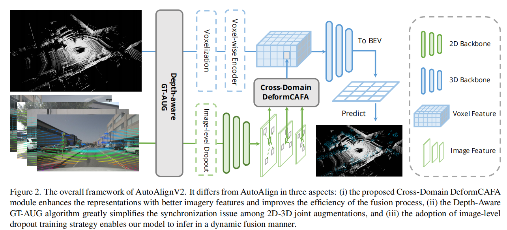
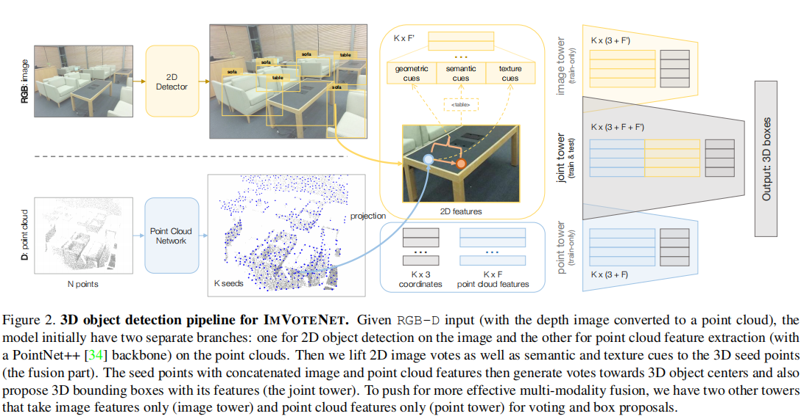
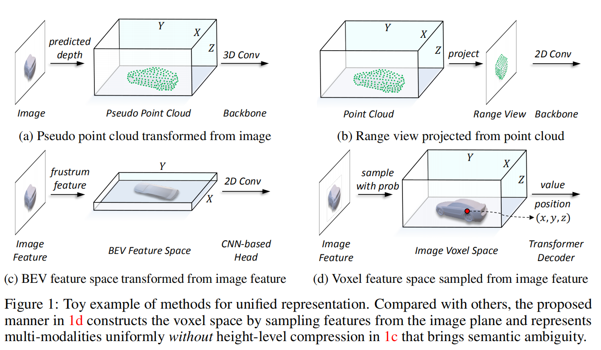

# ht_3Ddetection
> 用于记录在3D目标检测方面的学习
>

最近想到了一个少样本 图像和点云融合来检测物体的idea，就对3D目标检测方面进行了了解，并试着跑了跑mmdetection3D，配了三个版本（v1.0.0rc4,v1.1.0rc0,v1.0.0rc2）的环境，但是跑起来都存在一定的问题，所以后面有时间再看看吧（mmdetection3d好像最近在改框架，等下一个release吧）

- mmdetection3D框架

  - [官方文档](https://mmdetection3d.readthedocs.io/en/latest/getting_started.html)
  - [项目地址](https://github.com/open-mmlab/mmdetection3d.git)

- 多模态算法

  [论文在这里](https://github.com/HT-hlf/ht_3Ddetection/tree/master/doc)

  - autoalignv2

  

  - imvotenet

  

  - UVRT

  

- 数据集

  - Kitti数据集：

    链接：https://pan.baidu.com/s/1XElW32qqanI6v9ixl7r70g 
    提取码：v8hm 

  - SUNRGBD数据集

    链接：https://pan.baidu.com/s/1sRnJMR91qqV_K-FG1CnkWw 
    提取码：ox4z 

